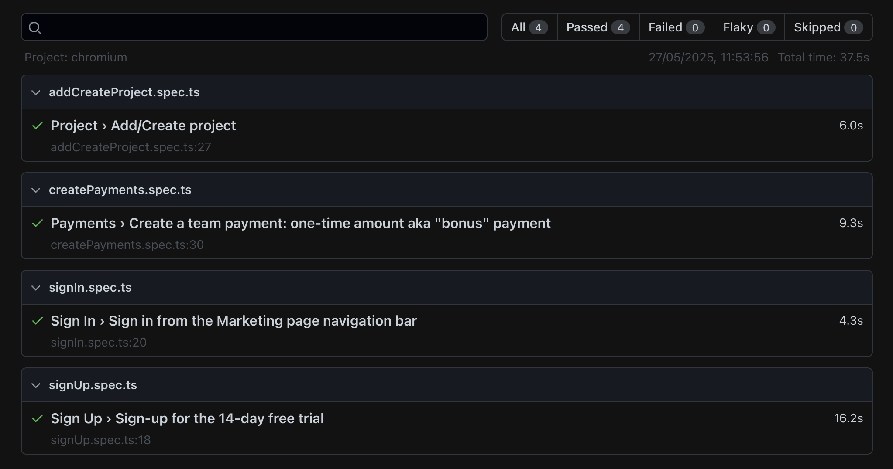

# hubstaff-qa


## Prerequisites
Create your own `.env` file in the main route and add the following:

```bash
BASEURL = 'hubstaff baseUrl'
MAILSURPAPIKEY = 'api-key'
```
Navigate to `https://www.mailslurp.com/` and create a free account and confirm.
Copy the APIKEY that will be passed into .env file.
Mailsurp - 3rd party service used for email confirmation

## Running the tests

Clone the repository
```bash
git clone https://github.com/SPASCUGHE/hubstaff-qa
```
Install dependencies
```bash
npm install
```
Install playwright browsers
```bash
npx playwright install
```
Run the tests
```bash
npm test
```
Generate playwright test report
```bash
npm report
```

## QA Results Hub integration

Playwright writes JUnit XML to `reports/junit.xml`. GitHub Actions uploads it as the `junit-results` artifact for the QA Results Hub thesis MVP (`../qa-automation-hub`).

See `../qa-automation-hub/docs/hubstaff-qa-integration.md` for connecting CI results to the dashboard.

### GitHub Actions secrets

| Name | Required | Description |
|------|----------|-------------|
| `MAILSURPAPIKEY` | Yes | MailSlurp API key for signup flow |
| `BASEURL` | No | Defaults to `https://hubstaff.com/` |

## Test results
